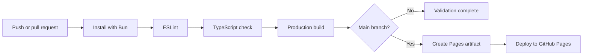

# Amjad Azward - Personal Portfolio

A modern editorial portfolio showcasing my work across software engineering, data science, cloud technologies, and machine learning.

[](https://github.com/AmjadAzward/azward-portfolio/actions/workflows/deploy-pages.yml)
[](https://amjadazward.github.io/azward-portfolio/)
[](https://www.typescriptlang.org/)

[View Live Portfolio](https://amjadazward.github.io/azward-portfolio/) | [Explore Repository](https://github.com/AmjadAzward/azward-portfolio) | [Connect on LinkedIn](https://www.linkedin.com/in/amjadazward)

## About the Portfolio

This website brings my profile, experience, technical capabilities, credentials, services, and selected projects into one focused digital portfolio. Its visual direction combines large editorial typography, a blue-led design system, subtle grid details, and purposeful motion.

The experience is designed to remain clear, responsive, accessible, and fast across mobile and desktop devices.

## Portfolio Highlights

- Distinctive editorial interface with a consistent blue visual system
- Responsive layouts built for mobile, tablet, laptop, and large displays
- Light and dark themes with saved user preferences
- Smooth page transitions, reveal animations, and interactive depth effects
- Reduced-motion support for users who prefer minimal animation
- Keyboard-friendly navigation with visible focus states
- Optimized profile, project, and certification media
- Centralized typed data for easier content maintenance
- Static route generation with GitHub Pages-compatible navigation
- Automated quality checks and deployment through GitHub Actions

## Featured Sections

| Section            | What it showcases                                                            |
| ------------------ | ---------------------------------------------------------------------------- |
| **Home**           | Personal introduction, primary actions, and profile presentation             |
| **About**          | Education, industry experience, location, and professional direction         |
| **Skills**         | Languages, frameworks, cloud platforms, databases, and supporting tools      |
| **Certifications** | Professional credentials, issuing organizations, and verification links      |
| **Services**       | Development, cloud, machine learning, analytics, and product capabilities    |
| **Portfolio**      | Selected projects with imagery, descriptions, technologies, and source links |
| **Contact**        | Direct contact flow and professional social profiles                         |

## Technology Stack

| Area                      | Technologies                             | Purpose                                                          |
| ------------------------- | ---------------------------------------- | ---------------------------------------------------------------- |
| **Frontend**              | React 19, TypeScript                     | Component-based, type-safe interface development                 |
| **Application framework** | TanStack Start, TanStack Router          | Routing, application structure, and static prerendering          |
| **Build tooling**         | Vite 8, Bun                              | Fast development, dependency installation, and optimized builds  |
| **Styling**               | Tailwind CSS 4, custom CSS design tokens | Responsive layouts, themes, typography, and visual consistency   |
| **UI primitives**         | Radix UI, Class Variance Authority       | Accessible, reusable interface foundations                       |
| **Motion**                | Motion                                   | Route transitions, reveals, hover effects, and interactive depth |
| **Icons**                 | Lucide React                             | Consistent lightweight interface icons                           |
| **Code quality**          | ESLint, Prettier, TypeScript compiler    | Static analysis, formatting, and type validation                 |
| **Automation**            | GitHub Actions                           | Continuous integration and continuous deployment                 |
| **Hosting**               | GitHub Pages                             | Secure static portfolio hosting                                  |

## Architecture and Engineering

- **File-based routing:** Individual route modules keep every page isolated and maintainable.
- **Reusable UI:** Shared components provide consistent sections, buttons, navigation, motion, and interactive surfaces.
- **Typed content:** Portfolio information is maintained separately in `src/data/portfolio.ts`.
- **Design tokens:** Global colors, spacing, borders, and themes are managed through the shared style system.
- **Base-path awareness:** Production assets and routes work correctly from the GitHub repository subpath.
- **Static delivery:** Routes are prerendered for dependable GitHub Pages delivery and direct page access.
- **Graceful navigation fallback:** A generated fallback document preserves client-side routing on refresh.

## CI/CD Pipeline

The project uses GitHub Actions for a gated CI/CD workflow.



### Continuous Integration

Every pull request targeting `main` runs:

1. Reproducible dependency installation using the locked Bun dependencies
2. ESLint analysis
3. TypeScript validation without emitting build files
4. A complete production build

Pull requests receive validation only and cannot deploy the live website.

### Continuous Deployment

Every push to `main`:

1. Passes the same CI quality gate
2. Generates the static portfolio with the correct repository base path
3. Prepares the GitHub Pages routing fallback
4. Uploads the production artifact
5. Deploys only after the validation job succeeds

The workflow includes dependency caching, manual dispatch support, least-privilege deployment permissions, and concurrency protection against outdated deployments.

Workflow: [.github/workflows/deploy-pages.yml](.github/workflows/deploy-pages.yml)

## Getting Started

### Prerequisite

Install [Bun](https://bun.sh/docs/installation).

### Install and Run

```bash
git clone https://github.com/AmjadAzward/azward-portfolio.git
cd azward-portfolio
bun install
bun run dev
```

Open the local address displayed in the terminal.

## Available Scripts

| Command             | Description                                      |
| ------------------- | ------------------------------------------------ |
| `bun run dev`       | Start the local development server               |
| `bun run build`     | Create an optimized production build             |
| `bun run build:dev` | Create a build using development mode            |
| `bun run preview`   | Preview the production build locally             |
| `bun run lint`      | Analyze the project with ESLint                  |
| `bun run typecheck` | Validate TypeScript without creating build files |
| `bun run format`    | Format the codebase with Prettier                |

## Project Structure

```text
azward-portfolio/
|-- .github/workflows/   CI/CD and GitHub Pages deployment
|-- public/              Static assets, favicon, profile image, and CV
|-- src/
|   |-- components/      Reusable portfolio and UI components
|   |-- data/            Typed portfolio content
|   |-- hooks/           Shared React hooks
|   |-- lib/             Utilities and application helpers
|   |-- routes/          File-based page routes
|   `-- styles.css       Global styles, themes, and design tokens
|-- package.json         Scripts and dependencies
|-- vite.config.ts       Build and static rendering configuration
`-- README.md            Project documentation
```

## Quality Standards

- Type-safe implementation
- Responsive and mobile-friendly design
- Accessible interaction states
- Reduced-motion compatibility
- Reproducible dependency installation
- Automated lint, type-check, and build validation
- Deployment blocked when validation fails

## Deployment

The production website is hosted on GitHub Pages and automatically updated from `main`.

- Live site: [amjadazward.github.io/azward-portfolio](https://amjadazward.github.io/azward-portfolio/)
- Actions: [CI/CD workflow runs](https://github.com/AmjadAzward/azward-portfolio/actions)
- Repository: [github.com/AmjadAzward/azward-portfolio](https://github.com/AmjadAzward/azward-portfolio)

## Connect

- [LinkedIn](https://www.linkedin.com/in/amjadazward)
- [GitHub](https://github.com/AmjadAzward)
- [X](https://x.com/AmjadAzward)
- [Instagram](https://www.instagram.com/amjadazward/)
- [Facebook](https://www.facebook.com/people/Amjad-Azward/pfbid0p75bKuomqfx8QvpRjKN4XQdVfdhoTByrqZcwuYqXtgCLPanQz2LR6Mc1e5zBLmo1l/)

## Author

Designed and developed by **Amjad Azward**.
